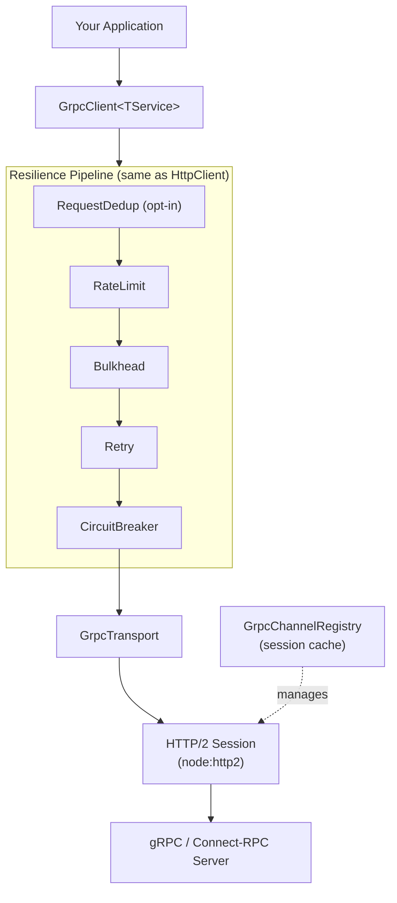
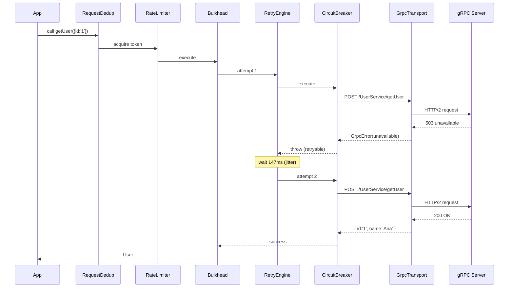
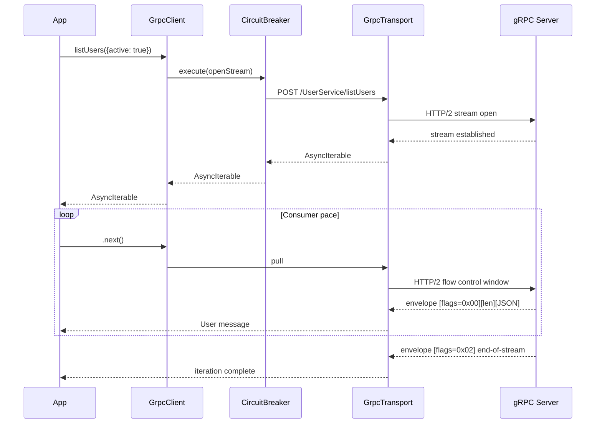

# gRPC Support

super-http ships a first-class gRPC client via the `super-http/grpc` entry point.
It is **TypeScript-first** (no `.proto` files required), runs the same resilience
pipeline as the HTTP client (circuit breaker, retry, bulkhead, rate limiter,
metrics), and speaks the [Connect-RPC](https://connectrpc.com) JSON protocol
over native Node.js HTTP/2 — with zero extra dependencies.

```ts
import { defineService, unary, serverStream, createGrpcClient } from 'super-http/grpc'

const UserService = defineService('UserService', {
  getUser:   unary<{ id: string }, User>(),
  listUsers: serverStream<{ filter?: string }, User>(),
})

const client = createGrpcClient(UserService, 'grpcs://api.example.com:443', {
  preset: 'resilient-api',   // circuit breaker + retry x3 + bulkhead
})

const user = await client.getUser({ id: '1' })           // Promise<User>
for await (const u of client.listUsers({ filter: 'active' })) { … } // AsyncIterable<User>
```

---

## Why not `@grpc/grpc-js`?

| | @grpc/grpc-js | nice-grpc | Connect-RPC | **super-http/grpc** |
|---|---|---|---|---|
| `.proto` files required | ✅ | ✅ | ✅ | ❌ TypeScript-first |
| Circuit breaker | ❌ | ❌ | ❌ | ✅ same as HTTP |
| Retry | ❌ | ❌ | ❌ | ✅ same as HTTP |
| Bulkhead | ❌ | ❌ | ❌ | ✅ same as HTTP |
| NestJS DI | manual | manual | manual | ✅ `@InjectSuperHttp` |
| Streaming backpressure | callbacks | callbacks | callbacks | ✅ `AsyncIterable` |
| Presets | ❌ | ❌ | ❌ | ✅ zero-config |
| Extra dependencies | `@grpc/grpc-js` | `nice-grpc` + grpc-js | `@connectrpc/*` + protobuf | **none** |

The core advantage: if you already use super-http for HTTP, adding gRPC requires
**zero new concepts** — same `.on()` hooks, same presets, same `MetricsSnapshot`,
same NestJS decorators.

---

## Architecture



---

## Installation

No extra packages needed — `super-http/grpc` uses Node.js native `http2`:

```bash
npm install super-http
# Node.js >= 20 · TypeScript >= 5
```

::: tip Wire format
super-http/grpc uses the **Connect-RPC JSON** protocol by default
(`Content-Type: application/connect+json`). This means any JSON-serialisable
TypeScript type works as a request or response — no `Message` classes, no
code generation.

To use protobuf binary encoding, see [Binary encoding](#binary-encoding).
:::

---

## Service definition

Define your service once in TypeScript. This is the single source of truth — it
drives both compile-time type inference and runtime dispatch.

```ts
import { defineService, unary, serverStream, clientStream, bidi } from 'super-http/grpc'

// Your domain types
interface GetUserRequest { id: string }
interface ListFilter      { active?: boolean; role?: string }
interface CreateUserInput { name: string; email: string }
interface User            { id: string; name: string; email: string }
interface LogEntry        { level: string; message: string; timestamp: number }
interface UploadSummary   { received: number; failed: number }
interface ChatMessage     { text: string; from: string }

const UserServiceDef = defineService('UserService', {
  // Unary: one request → one response
  getUser:    unary<GetUserRequest, User>(),
  createUser: unary<CreateUserInput, User>(),

  // Server streaming: one request → stream of responses
  listUsers:  serverStream<ListFilter, User>(),

  // Client streaming: stream of requests → one response
  uploadLogs: clientStream<LogEntry, UploadSummary>(),

  // Bidirectional streaming: stream ↔ stream
  chat:       bidi<ChatMessage, ChatMessage>(),
})
```

### Method call types

| Helper | Direction | TypeScript return |
|---|---|---|
| `unary<TReq, TRes>()` | 1 → 1 | `(req: TReq) => Promise<TRes>` |
| `serverStream<TReq, TRes>()` | 1 → N | `(req: TReq) => AsyncIterable<TRes>` |
| `clientStream<TReq, TRes>()` | N → 1 | `(stream: AsyncIterable<TReq>) => Promise<TRes>` |
| `bidi<TReq, TRes>()` | N → N | `(stream: AsyncIterable<TReq>) => AsyncIterable<TRes>` |

---

## Creating a client

```ts
import { createGrpcClient } from 'super-http/grpc'

const client = createGrpcClient(UserServiceDef, 'grpcs://api.example.com:443', {
  preset:  'resilient-api',
  headers: { 'x-api-key': process.env.API_KEY! },
})
```

### Address formats

| Format | Protocol |
|---|---|
| `grpc://host:port` | Insecure HTTP/2 |
| `grpcs://host:port` | TLS HTTP/2 |
| `host:port` | Insecure HTTP/2 (shorthand) |
| `http://host:port` | Insecure HTTP/2 |
| `https://host:port` | TLS HTTP/2 |

---

## Making calls

### Unary

```ts
// Fully typed — TypeScript infers User from the service definition
const user = await client.getUser({ id: '42' })
console.log(user.name)

// Per-call options: custom headers, timeout, cancellation
const ac = new AbortController()
const user2 = await client.getUser({ id: '1' }, {
  metadata:  { 'x-request-id': requestId },
  timeoutMs: 5_000,
  signal:    ac.signal,
})
```

### Server streaming

```ts
// Async generator — native backpressure, no callbacks
for await (const user of client.listUsers({ active: true })) {
  console.log(user.name)
  await processUser(user)   // if slow, HTTP/2 flow control pauses the stream
}
```

### Client streaming

```ts
async function* generateLogs(): AsyncIterable<LogEntry> {
  for (const entry of logBuffer) {
    yield entry
  }
}

const summary = await client.uploadLogs(generateLogs())
console.log(`Uploaded ${summary.received} logs, ${summary.failed} failed`)
```

### Bidirectional streaming

```ts
async function* messages(): AsyncIterable<ChatMessage> {
  yield { text: 'Hello!', from: 'alice' }
  yield { text: 'How are you?', from: 'alice' }
}

for await (const reply of client.chat(messages())) {
  console.log(`${reply.from}: ${reply.text}`)
}
```

---

## Configuration

### Presets (zero-config)

::: warning Changed in 2.0
An unknown preset name now throws. It used to be silently ignored, producing a
client with **no resilience configured at all** while the calling code read as
though a preset were in force.
:::


Same preset names as the HTTP client:

```ts
// resilient-api: circuit breaker + retry x3 + bulkhead
const client = createGrpcClient(Svc, address, { preset: 'resilient-api' })

// high-throughput: 4 sessions, retry x1, no CB
const client = createGrpcClient(Svc, address, { preset: 'high-throughput' })

// low-latency: 4 sessions, 2s timeout, no retry
const client = createGrpcClient(Svc, address, { preset: 'low-latency' })
```

| Preset | Sessions | Timeout | Retry | Circuit Breaker | Bulkhead |
|---|---|---|---|---|---|
| `high-throughput` | 4 | 8 s | 1x jitter | — | — |
| `resilient-api` | 2 | 15 s | 3x jitter | 10 failures → open | 50 concurrent |
| `low-latency` | 4 | 2 s | — | — | — |

### Manual configuration

All preset fields are individually overridable:

```ts
import { ExponentialJitterRetryStrategy } from 'super-http'

const client = createGrpcClient(UserServiceDef, 'grpcs://api:443', {
  // Connection
  maxSessions:  2,
  timeoutMs:    10_000,
  headers:      { 'x-service': 'my-app' },

  // Retry
  retries:       3,
  retryStrategy: new ExponentialJitterRetryStrategy(100, 5_000),

  // Circuit breaker
  circuitBreaker: {
    failureThreshold: 10,
    successThreshold:  3,
    timeoutMs:        10_000,
  },

  // Bulkhead
  bulkhead: {
    maxConcurrent: 50,
    maxQueue:      200,
    queueTimeoutMs: 5_000,
  },

  // Rate limiter
  rateLimit: {
    permitLimit: 500,
    windowMs:   1_000,
  },

  // Coalesce concurrent unary calls with an identical payload into one RPC.
  // Off by default: two identical concurrent mutations are not necessarily one
  // mutation, and only the server knows whether its method is idempotent.
  dedup: false,

  // Wire format
  encoding: 'json',      // or 'proto' (requires @bufbuild/protobuf)
  protocol: 'connect',   // or 'grpc' / 'grpc-web'
})
```

### Observability hooks

```ts
const client = createGrpcClient(UserServiceDef, 'grpcs://api:443', {
  preset: 'resilient-api',
  on: {
    onRetry: ({ attempt, delayMs, error }) =>
      logger.warn(`gRPC retry #${attempt} in ${delayMs}ms: ${error}`),

    onCircuitStateChange: ({ from, to, failures }) =>
      to === 'open' && alerts.critical(`gRPC circuit open (${failures} failures)`),

    onBulkheadReject: ({ active, queued }) =>
      metrics.inc('grpc.bulkhead.reject', { active, queued }),
  },
})

// Or add hooks after creation
client.on({
  onRetry: ({ attempt }) => console.warn(`retry #${attempt}`),
})
```

---

## Error handling

All non-OK gRPC responses throw a `GrpcError`:

```ts
import { GrpcError } from 'super-http/grpc'

try {
  const user = await client.getUser({ id: 'missing' })
} catch (err) {
  if (err instanceof GrpcError) {
    console.log(err.code)     // 'not_found'
    console.log(err.message)  // 'user not found'
    console.log(err.details)  // optional structured details
  }
}
```

### Status codes and resilience decisions

The retry and circuit breaker layers use gRPC status codes to decide automatically
what to do:

| Code | Retryable | Trips circuit | Notes |
|---|---|---|---|
| `unavailable` | ✅ | ✅ | Service down — retry and trip |
| `resource_exhausted` | ✅ | ❌ | Backpressure — retry after delay |
| `deadline_exceeded` | ✅ | ✅ | Timeout — retry |
| `aborted` | ✅ | ❌ | Optimistic lock conflict — retry |
| `unknown` | ✅ | ✅ | Unknown server error |
| `internal` | ❌ | ✅ | Server bug — trip, don't retry |
| `not_found` | ❌ | ❌ | Client error — fail fast |
| `permission_denied` | ❌ | ❌ | Auth error — fail fast |
| `invalid_argument` | ❌ | ❌ | Client error — fail fast |
| `unimplemented` | ❌ | ❌ | Method not available |

You can inspect a code's decision programmatically:

```ts
import { getDecision } from 'super-http/grpc'

const { retryable, tripCircuit } = getDecision('unavailable')
// { retryable: true, tripCircuit: true }
```

::: warning Fixed in 2.0
The `Trips circuit` column above describes what this table always intended — but
until 2.0 the function implementing it was never called. Every error counted
toward the breaker, so a burst of `not_found` or `unauthenticated` would open the
circuit on a perfectly healthy service. The decisions are now enforced.
:::

---

## Resilience pipeline explained



### Streaming pipeline

For streaming calls, the circuit breaker and rate limiter wrap only the **stream
open** phase. The actual message flow is consumer-paced via AsyncIterable — if
your consumer is slow, HTTP/2 flow control naturally pauses the server.



---

## Metrics

`GrpcClient` uses the same `MetricsCollector` as `HttpClient`:

```ts
const m = client.metrics()

console.log(m.requests)            // total RPC calls
console.log(m.success)             // successful calls
console.log(m.failed)              // failed calls
console.log(m.retries)             // retry attempts fired
console.log(m.circuitBreakerTrips) // times circuit opened
console.log(m.p50Latency)          // p50 call latency (ms)
console.log(m.p99Latency)          // p99 call latency (ms)

// Reset counters
client.resetMetrics()
```

---

## NestJS integration

gRPC clients work with the same `SuperHttpModule.forFeature()` and
`@InjectSuperHttp()` as HTTP clients.

### Mixed HTTP + gRPC feature registration

```ts
// posts.module.ts
import { Module } from '@nestjs/common'
import { SuperHttpModule } from 'super-http/nestjs'
import { UserServiceDef } from './user-service.def'

@Module({
  imports: [
    SuperHttpModule.forFeature([
      // HTTP client
      {
        name:    'CATALOG_HTTP',
        baseURL: 'https://catalog.internal',
        preset:  'high-throughput',
      },
      // gRPC client — distinguished by grpc: true
      {
        name:    'USER_GRPC',
        grpc:    true,
        address: 'user-service.internal:50051',
        service: UserServiceDef,
        preset:  'resilient-api',
      },
    ]),
  ],
  providers: [PostsService],
  exports:   [PostsService],
})
export class PostsModule {}
```

### Injecting a gRPC client

```ts
// posts.service.ts
import { Injectable } from '@nestjs/common'
import { InjectSuperHttp } from 'super-http/nestjs'
import type { GrpcClient } from 'super-http/grpc'
import type { UserServiceDef } from './user-service.def'

@Injectable()
export class PostsService {
  constructor(
    @InjectSuperHttp('USER_GRPC')
    private readonly users: GrpcClient<typeof UserServiceDef>,
  ) {}

  async getPostWithAuthor(postId: string) {
    const [post, author] = await Promise.all([
      this.fetchPost(postId),
      this.users.getUser({ id: postId }),  // fully typed
    ])
    return { ...post, author }
  }

  async *streamActiveUsers() {
    yield* this.users.listUsers({ active: true })
  }
}
```

### Unit testing with mocks

```ts
// posts.service.spec.ts
import { getSuperHttpClientToken } from 'super-http/nestjs'

const mockUserGrpc = {
  getUser:   jest.fn(),
  listUsers: jest.fn(),
}

describe('PostsService', () => {
  let service: PostsService

  beforeEach(async () => {
    const module = await Test.createTestingModule({
      providers: [
        PostsService,
        {
          provide:   getSuperHttpClientToken('USER_GRPC'),
          useValue:  mockUserGrpc,
        },
      ],
    }).compile()

    service = module.get(PostsService)
    jest.clearAllMocks()
  })

  it('fetches user via gRPC', async () => {
    mockUserGrpc.getUser.mockResolvedValue({ id: '1', name: 'Ana', email: 'ana@acme.com' })

    const result = await service.getPostWithAuthor('1')
    expect(result.author.name).toBe('Ana')
    expect(mockUserGrpc.getUser).toHaveBeenCalledWith({ id: '1' })
  })
})
```

---

## Binary encoding (protobuf)

By default, super-http/grpc uses JSON encoding. To use protobuf binary (smaller
payloads, stricter schema), install `@bufbuild/protobuf` and use generated
`Message` classes as your types:

```bash
npm install @bufbuild/protobuf
# plus your code generator of choice (e.g. buf)
```

```ts
import { GetUserRequest, User } from './gen/user_pb'   // generated Message classes

const UserServiceDef = defineService('UserService', {
  getUser: unary<GetUserRequest, User>(),
})

const client = createGrpcClient(UserServiceDef, 'grpcs://api:443', {
  encoding: 'proto',   // switch to binary
})
```

::: warning Proto binary requires Message classes
`encoding: 'proto'` requires that your request and response types extend
`@bufbuild/protobuf`'s `Message` base class. Plain TypeScript interfaces
only work with `encoding: 'json'` (the default).
:::

---

## Protocol compatibility

The `protocol` option controls the wire framing:

| Value | Content-Type | Works with |
|---|---|---|
| `connect` (default) | `application/connect+json` | Connect-RPC servers (buf.build, any modern gRPC server with Connect adapter) |
| `grpc` | `application/grpc+json` | Standard gRPC over HTTP/2 (any server) |
| `grpc-web` | `application/grpc-web+json` | gRPC-Web (through proxies, Envoy) |

```ts
// Connecting to a standard gRPC server (not Connect-RPC)
const client = createGrpcClient(UserServiceDef, 'grpcs://api:443', {
  protocol: 'grpc',
  encoding: 'json',   // JSON-encoded protobuf fields
})
```

---

## Advanced: non-idempotent mutations

Disable retry for mutations that must not be sent twice:

```ts
// Pass retry: false as a per-call option
const newUser = await client.createUser(
  { name: 'Ana', email: 'ana@acme.com' },
  { retry: false },   // non-idempotent — no retry
)
```

---

## Advanced: cancellation

```ts
const ac = new AbortController()

// Cancel after 2 s
setTimeout(() => ac.abort(), 2_000)

try {
  const user = await client.getUser({ id: '1' }, { signal: ac.signal })
} catch (err) {
  if (err instanceof GrpcError && err.code === 'canceled') {
    console.log('Request was cancelled')
  }
}
```

---

## Advanced: custom per-call metadata

```ts
// Propagate tracing headers per call
const user = await client.getUser({ id: '1' }, {
  metadata: {
    'x-trace-id':   span.traceId,
    'x-request-id': requestId,
    'authorization': `Bearer ${token}`,
  },
})
```

---

## Channel management

HTTP/2 sessions are cached automatically by `GrpcChannelRegistry`. Each address
gets up to `maxSessions` sessions (default 2), and HTTP/2 multiplexes thousands
of concurrent RPCs over each session.

```ts
import { GrpcChannelRegistry } from 'super-http/grpc'

// Current open sessions (for health endpoints)
console.log(GrpcChannelRegistry.sessionCount)

// Graceful drain — waits for in-flight RPCs to complete
await GrpcChannelRegistry.closeAddress('grpcs://api.example.com:443')

// Close all sessions (e.g. on app shutdown)
await GrpcChannelRegistry.closeAll()

// Immediate destroy (useful in tests)
GrpcChannelRegistry.clear()
```

---

## Testing patterns

### Unit tests — mock the transport

```ts
import { GrpcTransport } from 'super-http/grpc'

jest.spyOn(GrpcTransport.prototype, 'call').mockResolvedValue({
  data: { id: '1', name: 'Ana', email: 'ana@acme.com' },
  transportType: 'grpc',
})

const client = createGrpcClient(UserServiceDef, 'grpc://localhost:50051')
const user = await client.getUser({ id: '1' })
expect(user.name).toBe('Ana')
```

### Test server streaming

```ts
jest.spyOn(GrpcTransport.prototype, 'serverStream').mockReturnValue(
  (async function* () {
    yield { id: '1', name: 'Ana',  email: 'a@x.com' }
    yield { id: '2', name: 'Bob',  email: 'b@x.com' }
  })(),
)

const users: User[] = []
for await (const u of client.listUsers({})) users.push(u)
expect(users).toHaveLength(2)
```

### Integration tests — real server

Use any Connect-RPC compatible test server. The [Connect conformance suite](https://github.com/connectrpc/conformance) provides test servers for all languages.

```ts
// Clean up sessions between tests to avoid state leakage
afterEach(() => GrpcChannelRegistry.clear())
```

---

## Complete example

```ts
import {
  defineService, unary, serverStream, clientStream, bidi,
  createGrpcClient, GrpcError, GrpcChannelRegistry,
} from 'super-http/grpc'
import { ExponentialJitterRetryStrategy, LoggerPlugin } from 'super-http'

// ── 1. Define the service contract ──────────────────────────────────────────

interface GetUserRequest  { id: string }
interface ListFilter      { role?: string; active?: boolean }
interface User            { id: string; name: string; email: string; role: string }
interface LogEntry        { level: string; message: string }
interface UploadSummary   { received: number }

const UserServiceDef = defineService('UserService', {
  getUser:    unary<GetUserRequest, User>(),
  listUsers:  serverStream<ListFilter, User>(),
  uploadLogs: clientStream<LogEntry, UploadSummary>(),
})

// ── 2. Create a fully resilient client ─────────────────────────────────────

const userClient = createGrpcClient(
  UserServiceDef,
  process.env.USER_SERVICE_ADDRESS ?? 'grpcs://user-service:443',
  {
    preset:   'resilient-api',
    headers:  { 'x-service': 'checkout' },
    maxSessions: 2,

    // Fine-tune the preset
    circuitBreaker: { failureThreshold: 10, successThreshold: 3, timeoutMs: 10_000 },
    retryStrategy:  new ExponentialJitterRetryStrategy(100, 5_000),

    on: {
      onRetry: ({ attempt, error }) =>
        console.warn(`[users] retry #${attempt}: ${String(error)}`),
      onCircuitStateChange: ({ from, to, failures }) =>
        console.error(`[users] circuit ${from} → ${to} (${failures} failures)`),
    },
  },
)

// ── 3. Unary call with error handling ──────────────────────────────────────

async function getUser(id: string): Promise<User | null> {
  try {
    return await userClient.getUser({ id })
  } catch (err) {
    if (err instanceof GrpcError && err.code === 'not_found') return null
    throw err
  }
}

// ── 4. Server streaming with backpressure ──────────────────────────────────

async function printActiveAdmins(): Promise<void> {
  for await (const user of userClient.listUsers({ role: 'admin', active: true })) {
    await sendEmail(user.email)   // consumer pace drives HTTP/2 flow control
  }
}

// ── 5. Client streaming ────────────────────────────────────────────────────

async function* collectLogs(): AsyncIterable<LogEntry> {
  for (const entry of logBuffer) yield entry
}

async function flushLogs(): Promise<void> {
  const { received } = await userClient.uploadLogs(collectLogs(), { retry: false })
  console.log(`Flushed ${received} log entries`)
}

// ── 6. Metrics health endpoint ─────────────────────────────────────────────

function healthCheck() {
  const m = userClient.metrics()
  return {
    status:   m.circuitBreakerTrips > 0 ? 'degraded' : 'ok',
    grpc:     { requests: m.requests, errors: m.failed, p99: m.p99Latency },
    sessions: GrpcChannelRegistry.sessionCount,
  }
}

// ── 7. Graceful shutdown ───────────────────────────────────────────────────

process.on('SIGTERM', async () => {
  await GrpcChannelRegistry.closeAll()
  process.exit(0)
})
```

---

## API reference

### `defineService(name, methods)`

Creates a `ServiceDefinition` — the TypeScript-first service contract.

| Param | Type | Description |
|---|---|---|
| `name` | `string` | Fully-qualified service name (used in HTTP/2 path) |
| `methods` | `ServiceMethods` | Map of method name → descriptor |

### `unary<TReq, TRes>()`

Returns a `UnaryMethodDescriptor`. Client API: `(req: TReq) => Promise<TRes>`.

### `serverStream<TReq, TRes>()`

Returns a `ServerStreamMethodDescriptor`. Client API: `(req: TReq) => AsyncIterable<TRes>`.

### `clientStream<TReq, TRes>()`

Returns a `ClientStreamMethodDescriptor`. Client API: `(stream: AsyncIterable<TReq>) => Promise<TRes>`.

### `bidi<TReq, TRes>()`

Returns a `BidiStreamMethodDescriptor`. Client API: `(stream: AsyncIterable<TReq>) => AsyncIterable<TRes>`.

### `createGrpcClient(definition, address, config?)`

Creates a `GrpcClient<TDef>`. The returned object exposes:
- One typed method per service method
- `.metrics()` — `MetricsSnapshot`
- `.resetMetrics()` — clears counters
- `.on(events)` — add resilience hooks
- `.close()` — gracefully closes HTTP/2 sessions

### `GrpcError`

Thrown for all non-OK gRPC responses.

| Property | Type | Description |
|---|---|---|
| `.code` | `GrpcCode` | gRPC status code string (e.g. `'not_found'`) |
| `.message` | `string` | Human-readable error message |
| `.details` | `unknown[]` | Optional structured error details |
| `.metadata` | `Record<string, string>` | Optional response metadata |

### `GrpcClientConfig`

| Field | Type | Default | Description |
|---|---|---|---|
| `preset` | `Preset` | — | `'high-throughput'` \| `'resilient-api'` \| `'low-latency'` |
| `encoding` | `'json' \| 'proto'` | `'json'` | Wire encoding |
| `protocol` | `'connect' \| 'grpc' \| 'grpc-web'` | `'connect'` | Wire protocol |
| `timeoutMs` | `number` | `15000` | Default call timeout |
| `headers` | `Record<string, string>` | — | Default headers / metadata |
| `maxSessions` | `number` | `2` | HTTP/2 sessions per address |
| `retries` | `number` | `0` | Max retry attempts |
| `retryStrategy` | `RetryStrategy` | `ExponentialJitter(100, 10k)` | Backoff strategy |
| `circuitBreaker` | `CircuitBreakerConfig` | — | Circuit breaker config |
| `bulkhead` | `BulkheadConfig` | — | Bulkhead config |
| `rateLimit` | `RateLimitConfig` | — | Rate limit config |
| `on` | `ResilienceEvents` | — | Event hooks |
