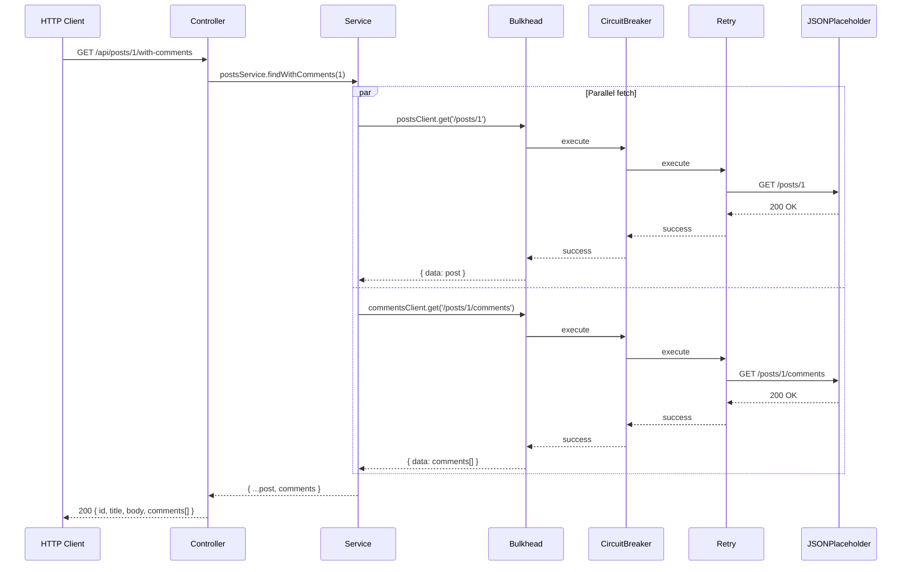
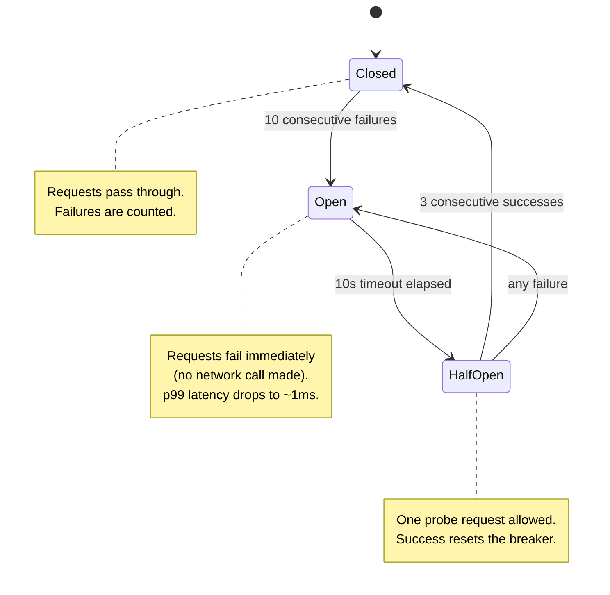
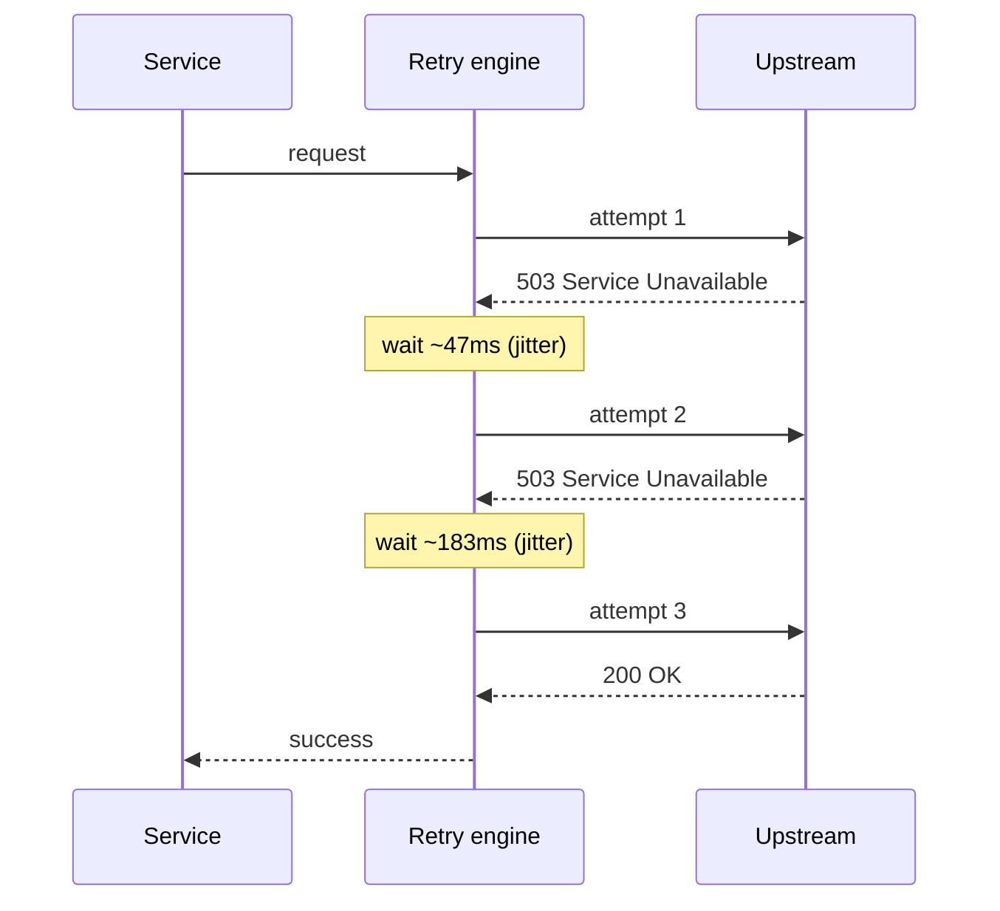
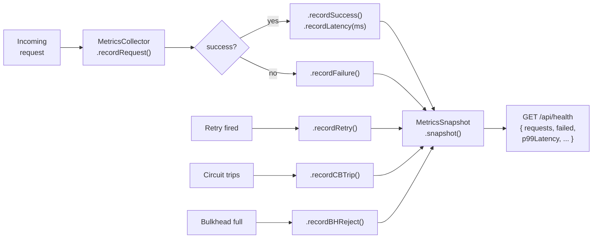

# NestJS Example Application

A complete, production-style NestJS application demonstrating every super-http
integration pattern in a real context. Use it as a reference implementation or
starting point for your own project.

**Source**: [`example/nestjs-app/`](https://github.com/jhonesgoncalves/super-http-ts/tree/main/example/nestjs-app)

---

## What it demonstrates

| Pattern | Where |
|---|---|
| `SuperHttpModule.forRootAsync` + `useClass` | `src/app.module.ts` |
| `SuperHttpOptionsFactory` implementation | `src/config/super-http.config.ts` |
| Default `SuperHttpService` injection | `src/users/users.service.ts` |
| Named clients with `SuperHttpModule.forFeature` | `src/posts/posts.module.ts` |
| `@InjectSuperHttp('NAME')` decorator | `src/posts/posts.service.ts` |
| Per-request policy on mutations | `src/posts/posts.service.ts` |
| Live metrics health endpoint | `src/health/health.controller.ts` |
| Unit tests with mock providers | `**/*.spec.ts` |
| Integration (e2e) tests | `test/app.e2e-spec.ts` |

---

## Architecture overview

The application is a REST API backed by [JSONPlaceholder](https://jsonplaceholder.typicode.com). It has three feature modules, each consuming HTTP clients in a different way.

```
┌─────────────────────────────────────────────────────────────┐
│                        AppModule                            │
│                                                             │
│  SuperHttpModule.forRootAsync(useClass: SuperHttpConfig)    │
│  ↳ registers default SuperHttpService (globally)           │
│                                                             │
│  ┌──────────────┐  ┌──────────────┐  ┌──────────────────┐  │
│  │ UsersModule  │  │ PostsModule  │  │  HealthModule    │  │
│  │              │  │              │  │                  │  │
│  │ SuperHttp    │  │ forFeature(  │  │ SuperHttpService │  │
│  │ Service ↓   │  │  POSTS       │  │ .metrics() ↓    │  │
│  │             │  │  COMMENTS)   │  │                  │  │
│  │ GET /users  │  │              │  │ GET /health     │  │
│  │ POST /users │  │ GET /posts   │  │                  │  │
│  │ PUT         │  │ GET /posts/  │  └──────────────────┘  │
│  │ DELETE      │  │  :id/with-   │                         │
│  └──────────────┘  │  comments   │                         │
│                    │ POST /posts │                         │
│                    └──────────────┘                         │
└─────────────────────────────────────────────────────────────┘
```

---

## Module dependency diagram

```mermaid
graph TD
    AppModule -->|forRootAsync| SuperHttpModule
    AppModule --> UsersModule
    AppModule --> PostsModule
    AppModule --> HealthModule

    SuperHttpModule -->|provides globally| SuperHttpService

    UsersModule -->|injects| SuperHttpService
    HealthModule -->|injects| SuperHttpService

    PostsModule -->|forFeature| PostsSuperHttpModule["SuperHttpModule\n(POSTS + COMMENTS)"]
    PostsSuperHttpModule -->|provides| PostsClient["HttpClient (POSTS)"]
    PostsSuperHttpModule -->|provides| CommentsClient["HttpClient (COMMENTS)"]
    PostsService -->|@InjectSuperHttp POSTS| PostsClient
    PostsService -->|@InjectSuperHttp COMMENTS| CommentsClient
```

---

## HTTP client topology

Each HTTP client has its own connection pool, circuit breaker, retry queue, and
bulkhead — they are fully isolated from each other.

```mermaid
graph LR
    subgraph Default client — resilient-api preset
        SHS["SuperHttpService\n(default)"] --> Pool1["Connection Pool\n100 sockets"]
        Pool1 --> CB1["Circuit Breaker\ntrip @ 10 failures"]
        CB1 --> Retry1["Retry × 3\nexponential jitter"]
        Retry1 --> BH1["Bulkhead\n50 concurrent / 200 queue"]
    end

    subgraph Named client — POSTS — high-throughput preset
        PC["HttpClient\nPOSTS"] --> Pool2["Connection Pool\n200 sockets"]
        Pool2 --> Retry2["Retry × 1\nquick jitter"]
    end

    subgraph Named client — COMMENTS — resilient-api preset
        CC["HttpClient\nCOMMMENTS"] --> Pool3["Connection Pool\n100 sockets"]
        Pool3 --> CB3["Circuit Breaker\ntrip @ 10 failures"]
        CB3 --> Retry3["Retry × 3\nexponential jitter"]
        Retry3 --> BH3["Bulkhead\n50 concurrent / 200 queue"]
    end

    BH1 --> JSONPlaceholder
    Retry2 --> JSONPlaceholder
    BH3 --> JSONPlaceholder
```

---

## Request lifecycle

When a request enters the NestJS controller, it passes through a layered
resilience pipeline before hitting the network.



---

## Circuit breaker state machine

The COMMENTS client uses a circuit breaker to protect the posts endpoint from
cascading failures when the comments service is down.



---

## Retry strategy

Both the default client and the COMMENTS client use **exponential jitter retry** — each attempt waits a random delay within a growing window, preventing thundering-herd on recovery.

```
Attempt 1 → wait random(0..100ms)
Attempt 2 → wait random(0..200ms)
Attempt 3 → wait random(0..400ms)
            max cap: 10 000ms
```



---

## Metrics flow

Every request updates the in-memory `MetricsCollector` regardless of retry or
circuit breaker state. The `GET /health` endpoint exposes a live snapshot.



---

## Project structure

```
example/nestjs-app/
├── src/
│   ├── app.module.ts               ← forRootAsync + ConfigModule
│   ├── app.controller.ts           ← GET /
│   ├── config/
│   │   └── super-http.config.ts    ← SuperHttpOptionsFactory (env vars)
│   │
│   ├── users/                      ← default SuperHttpService client
│   │   ├── users.module.ts
│   │   ├── users.controller.ts     ← GET / POST / PUT / DELETE /users
│   │   ├── users.service.ts        ← injects SuperHttpService
│   │   ├── users.service.spec.ts   ← unit tests (mocked)
│   │   ├── users.controller.spec.ts
│   │   └── dto/
│   │       └── create-user.dto.ts  ← class-validator decorators
│   │
│   ├── posts/                      ← two named clients (POSTS + COMMENTS)
│   │   ├── posts.module.ts         ← forFeature([POSTS, COMMENTS])
│   │   ├── posts.controller.ts     ← GET / POST /posts, GET /posts/:id/with-comments
│   │   ├── posts.service.ts        ← @InjectSuperHttp('POSTS') + ('COMMENTS')
│   │   └── posts.service.spec.ts
│   │
│   └── health/
│       ├── health.module.ts
│       ├── health.controller.ts    ← GET /health (live metrics)
│       └── health.controller.spec.ts
│
├── test/
│   └── app.e2e-spec.ts             ← 14 integration tests vs JSONPlaceholder
│
├── package.json
├── tsconfig.json                   ← emitDecoratorMetadata: true (required)
└── README.md
```

---

## Quick start

```bash
cd example/nestjs-app

# Install dependencies
npm install

# Start in development mode
npm run start:dev

# Run unit tests (28 tests, no network)
npm test

# Run integration tests (14 tests, requires internet)
npm run test:e2e
```

### Available endpoints

| Method | Path | Description |
|--------|------|-------------|
| `GET` | `/api` | Welcome |
| `GET` | `/api/health` | Live HTTP client metrics |
| `GET` | `/api/users` | List all users |
| `GET` | `/api/users/:id` | Get user by ID |
| `POST` | `/api/users` | Create user |
| `PUT` | `/api/users/:id` | Update user |
| `DELETE` | `/api/users/:id` | Delete user |
| `GET` | `/api/posts` | List all posts |
| `GET` | `/api/posts/:id` | Get post by ID |
| `GET` | `/api/posts/:id/with-comments` | Post + comments (parallel fetch) |
| `POST` | `/api/posts` | Create post |

---

## Key patterns explained

### 1. `forRootAsync` + `useClass` — config from environment

The root module registers a **global** default client using a factory class that
reads environment variables via `ConfigService`. This is the recommended pattern
for production apps.

```ts
// app.module.ts
SuperHttpModule.forRootAsync({
  imports:  [ConfigModule],   // ← make ConfigService available to the factory
  useClass: SuperHttpConfigService,
})
```

```ts
// config/super-http.config.ts
@Injectable()
export class SuperHttpConfigService implements SuperHttpOptionsFactory {
  constructor(private readonly config: ConfigService) {}

  createSuperHttpOptions(): SuperHttpModuleOptions {
    return {
      baseURL: this.config.get('JSONPLACEHOLDER_URL', 'https://jsonplaceholder.typicode.com'),
      preset: 'resilient-api',
      headers: { 'X-App-Name': 'my-app' },
    }
  }
}
```

::: tip Why `useClass` over `useFactory`?
`useClass` is better for complex configs — the factory class can have its own
injected dependencies and is trivially testable in isolation.
:::

---

### 2. Named clients with `forFeature`

`PostsModule` needs two independent clients with different resilience profiles.
`forFeature` creates both and provides them under named DI tokens.

```ts
// posts.module.ts
SuperHttpModule.forFeature([
  {
    name: 'POSTS',
    baseURL: 'https://jsonplaceholder.typicode.com',
    preset: 'high-throughput',   // large pool, 1 fast retry
  },
  {
    name: 'COMMENTS',
    baseURL: 'https://jsonplaceholder.typicode.com',
    preset: 'resilient-api',     // CB + 3 retries + bulkhead
  },
])
```

```ts
// posts.service.ts
constructor(
  @InjectSuperHttp('POSTS')    private readonly postsClient: HttpClient,
  @InjectSuperHttp('COMMENTS') private readonly commentsClient: HttpClient,
) {}
```

---

### 3. Parallel fetch across two clients

`findWithComments` fetches post and comments **simultaneously** from two
independent clients. If comments fail, the circuit breaker on the COMMENTS
client trips, failing fast on subsequent calls.

```ts
async findWithComments(postId: number) {
  const [postRes, commentsRes] = await Promise.all([
    this.postsClient.get<Post>(`/posts/${postId}`),
    this.commentsClient.get<Comment[]>(`/posts/${postId}/comments`),
  ])
  return { ...postRes.data, comments: commentsRes.data }
}
```

---

### 4. Per-request policy on mutations

`PostsService.create` disables retry for `POST` to avoid creating duplicate
resources on transient failures. The `policy` field is passed via `.request()`.

```ts
async create(dto: Omit<Post, 'id'>) {
  const { data } = await this.postsClient.request<Post>({
    method: 'POST',
    url: '/posts',
    data: dto,
    policy: { retry: false },  // ← non-idempotent: no retry
  })
  return data
}
```

---

### 5. Live metrics endpoint

`HealthController` reads the default client's `MetricsSnapshot` and computes a
simple health status in real time — no external monitoring required for basic observability.

```ts
@Get()
check(): HealthStatus {
  const m = this.http.metrics()
  const total  = m.requests
  const errors = m.failed
  const rate   = total > 0 ? (((total - errors) / total) * 100).toFixed(1) : '100.0'

  return {
    status: total > 10 && parseFloat(rate) < 95 ? 'degraded' : 'ok',
    uptime: process.uptime(),
    http: {
      requests:    total,
      errors,
      successRate: `${rate}%`,
      p99:         m.p99Latency > 0 ? `${m.p99Latency.toFixed(1)}ms` : 'N/A',
    },
  }
}
```

---

### 6. Testing approach

| Type | File | Technique |
|---|---|---|
| Unit (service) | `users.service.spec.ts` | Mock `SuperHttpService` with `useValue` |
| Unit (named client) | `posts.service.spec.ts` | Mock via `getSuperHttpClientToken('POSTS')` |
| Unit (controller) | `users.controller.spec.ts` | Mock the service class |
| Integration (e2e) | `test/app.e2e-spec.ts` | Full NestJS app + real JSONPlaceholder |

**Unit test — default client:**
```ts
{ provide: SuperHttpService, useValue: { get: jest.fn(), post: jest.fn() } }
```

**Unit test — named client:**
```ts
import { getSuperHttpClientToken } from 'super-http/nestjs'

{ provide: getSuperHttpClientToken('POSTS'),    useValue: { get: jest.fn() } }
{ provide: getSuperHttpClientToken('COMMENTS'), useValue: { get: jest.fn() } }
```

---

## Common pitfalls

### `import type` breaks `emitDecoratorMetadata`

When you use `import type { MyDto }` in a controller, TypeScript erases the
import at runtime. The compiler then emits `Function` instead of `MyDto` in the
parameter metadata — `ValidationPipe(transform: true)` can't construct the DTO
and passes the **class constructor itself** as the argument.

```ts
// ❌ import type erases runtime metadata
import type { CreateUserDto } from './dto/create-user.dto'

// ✅ value import preserves metadata for reflection
import { CreateUserDto } from './dto/create-user.dto'
```

### Missing `@IsString()` / class-validator decorators

`ValidationPipe({ whitelist: true })` strips all properties that have no
class-validator decorator. Always annotate DTO properties:

```ts
// ✅
export class CreateUserDto {
  @IsString() @MinLength(2) name: string
  @IsEmail()               email: string
  @IsString() @IsOptional() username?: string
}
```

### `ConfigModule` not in `forRootAsync` imports

When using `useClass`, the factory class is instantiated inside the
`SuperHttpModule` context. Any injected dependency (e.g. `ConfigService`) must
be imported there:

```ts
// ✅
SuperHttpModule.forRootAsync({
  imports:  [ConfigModule],   // ← required
  useClass: SuperHttpConfigService,
})
```

### Always enable `emitDecoratorMetadata` in `tsconfig.json`

```json
{
  "compilerOptions": {
    "experimentalDecorators": true,
    "emitDecoratorMetadata": true   // ← required for NestJS DI + ValidationPipe
  }
}
```
